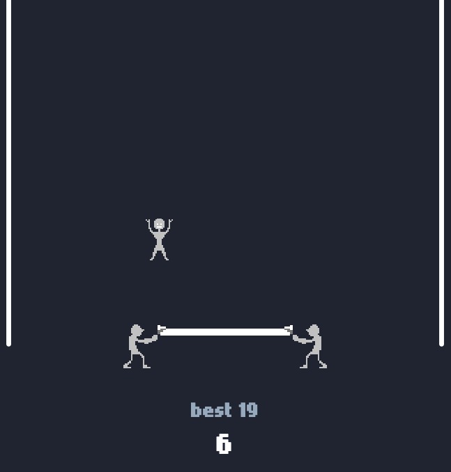

## 🎪 Sheet Happens 🏃‍♂️

<picture>
  
</picture>

🎮 Play [here](https://microstudio.dev/i/EJTheBae/sheethappens/) 🎮

**Sheet Happens** 🎈 is a simple, skill-based arcade game where two carriers 🤾‍♂️🤾‍♀️ hold a cloth 🛏️ and try to keep a jumper 🧑‍🦰 bouncing endlessly without letting him fall! ⬇️ Time your moves and stay centered 📍, the higher he goes ⬆️, the faster it gets! ⚡

## How to Play 🎯
**Desktop:** ⌨️ Use **A** / **D** or ← / → to move the carriers and keep the jumper landing safely on the sheet 🛏️.

**Mobile:** 📱 Tap the left or right side of the screen to move the carriers in that direction 👈👉.

Every successful bounce 🏀 earns you a point! ⭐ Miss the sheet, and it's **GAME OVER**! 💥😵
